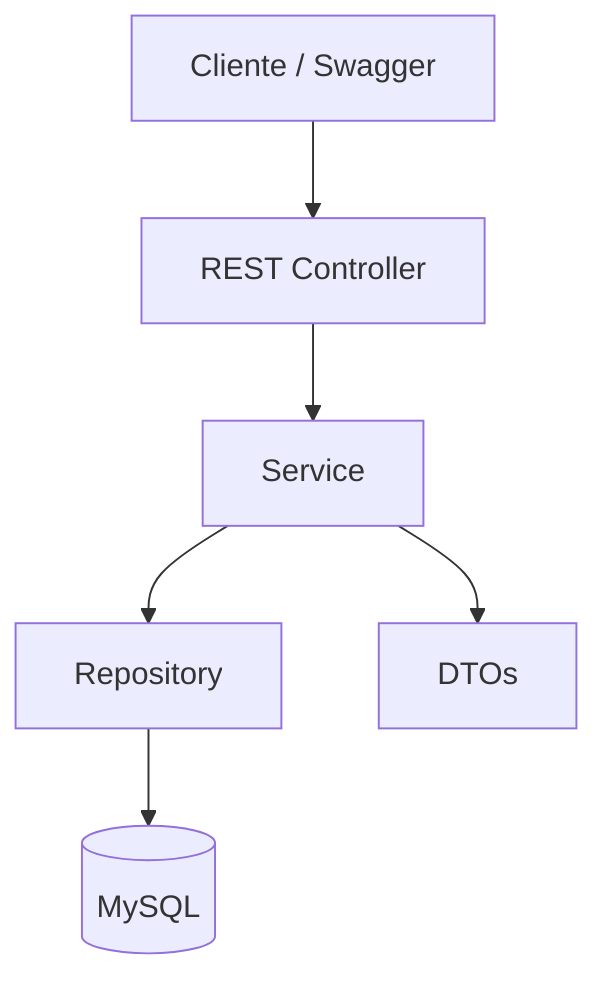
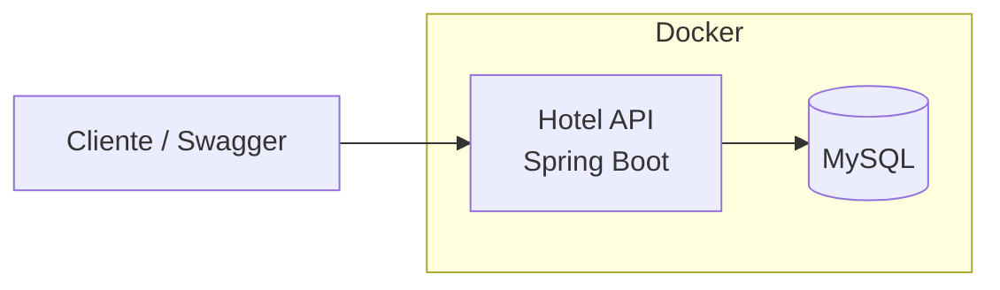

# Hotel API

API REST desenvolvida em **Java com Spring Boot** para gerenciamento de um sistema de hospedagem. O projeto simula operações relacionadas a **locadores, imóveis, clientes e reservas**, aplicando conceitos de desenvolvimento de APIs REST, DTOs, regras de negócio, persistência de dados e documentação de APIs.

> **⚠️ Projeto de estudos**
>
> Este projeto foi desenvolvido exclusivamente para fins de **estudo e aprendizado**. Não se trata de uma aplicação comercial ou de um sistema destinado à utilização em produção.

---

## 🏨 Sobre o projeto

O **Hotel API** é uma aplicação REST que simula parte do funcionamento de uma plataforma de hospedagem.

O sistema permite trabalhar com diferentes entidades do domínio, como:

* **Locadores** — responsáveis pelos imóveis cadastrados.
* **Imóveis** — propriedades disponíveis para hospedagem.
* **Clientes** — pessoas que realizam reservas.
* **Reservas** — registros de hospedagens realizadas pelos clientes.

Além das operações básicas de CRUD, o projeto possui algumas regras de negócio relacionadas ao cadastro, atualização, inativação e criação de reservas.

O principal objetivo é praticar conceitos comuns no desenvolvimento de aplicações backend utilizando o ecossistema Java e Spring.

---

## 🛠️ Tecnologias utilizadas

| Tecnologia            | Utilização                                       |
| --------------------- | ------------------------------------------------ |
| **Java**              | Linguagem principal do projeto                   |
| **Spring Boot**       | Desenvolvimento da API REST                      |
| **Spring Data JPA**   | Persistência e acesso aos dados                  |
| **MySQL**             | Banco de dados relacional                        |
| **Docker**            | Containerização da aplicação e banco de dados    |
| **Swagger / OpenAPI** | Documentação e visualização dos endpoints da API |
| **Maven**             | Gerenciamento de dependências e build do projeto |

---

## 🏗️ Arquitetura

A aplicação utiliza uma arquitetura em camadas, separando as responsabilidades entre **Controller, Service e Repository**.



### Camadas

**Controller**

Responsável por receber as requisições HTTP, realizar o direcionamento das operações e retornar as respostas da API.

**Service**

Contém as regras de negócio da aplicação, como validações, verificações de estado e processamento das operações.

**Repository**

Responsável pela comunicação com o banco de dados utilizando Spring Data JPA.

**DTOs**

Utilizados para controlar os dados recebidos e enviados pela API, evitando o acoplamento direto entre as requisições HTTP e as entidades de persistência.

**MySQL**

Banco de dados responsável pelo armazenamento das informações da aplicação.

---

## 🐳 Arquitetura com Docker

Quando executada utilizando Docker Compose, a aplicação e o banco de dados são executados em containers separados.



Essa abordagem permite configurar o ambiente da aplicação de maneira mais simples, evitando a necessidade de instalar e configurar manualmente o banco de dados para executar o projeto.

---

# 🚀 Configuração local

## Pré-requisitos

Para executar o projeto localmente, é necessário possuir:

* Java
* Maven
* Git

Para execução utilizando Docker:

* Docker
* Docker Compose

Para execução sem Docker:

* MySQL instalado e em execução

---

## 📥 Clonando o projeto

Clone o repositório:

```bash
git clone https://github.com/VictorBortolotto/rest-java-api.git
```

Entre no diretório do projeto:

```bash
cd rest-java-api
```

Compile e instale as dependências:

```bash
mvn clean install
```

---

# 🐳 Executando com Docker

Com o Docker instalado e em execução, execute:

```bash
docker compose up --build
```

O Docker Compose será responsável por criar e iniciar os containers necessários para a aplicação.

Para encerrar a aplicação:

```bash
docker compose down
```

---

# 💻 Executando localmente

Também é possível executar a aplicação diretamente pelo Maven, sem utilizar Docker.

### 1. Criar o banco de dados

É necessário possuir uma instalação local do **MySQL** em execução.

Crie um banco de dados chamado:

```sql
CREATE DATABASE hotel;
```

### 2. Executar a aplicação

Após configurar o banco de dados, execute:

```bash
mvn spring-boot:run
```

A aplicação será iniciada utilizando a configuração definida no projeto.

---

# 📖 Documentação da API

A API possui documentação utilizando **Swagger / OpenAPI**, permitindo visualizar e testar os endpoints disponíveis diretamente pelo navegador.

Após iniciar a aplicação, acesse a interface do Swagger pela URL configurada no projeto.

---

## 📌 Objetivos de estudo

Este projeto foi desenvolvido com o objetivo de praticar:

* Desenvolvimento de APIs REST com Spring Boot;
* Operações CRUD;
* Arquitetura em camadas;
* Utilização de DTOs;
* Regras de negócio;
* Validação de dados;
* Persistência com Spring Data JPA;
* Integração com MySQL;
* Documentação utilizando Swagger/OpenAPI;
* Containerização utilizando Docker;
* Organização e estruturação de projetos Java.

---

## 📄 Licença

Este projeto é destinado exclusivamente para fins educacionais e de estudo.

---

# Autor

**Victor Augusto Campos Bortolotto**


[](https://www.linkedin.com/in/victor-augusto-campos-bortolotto/)
[](mailto:victorcamposbortolottowork@gmail.com)
