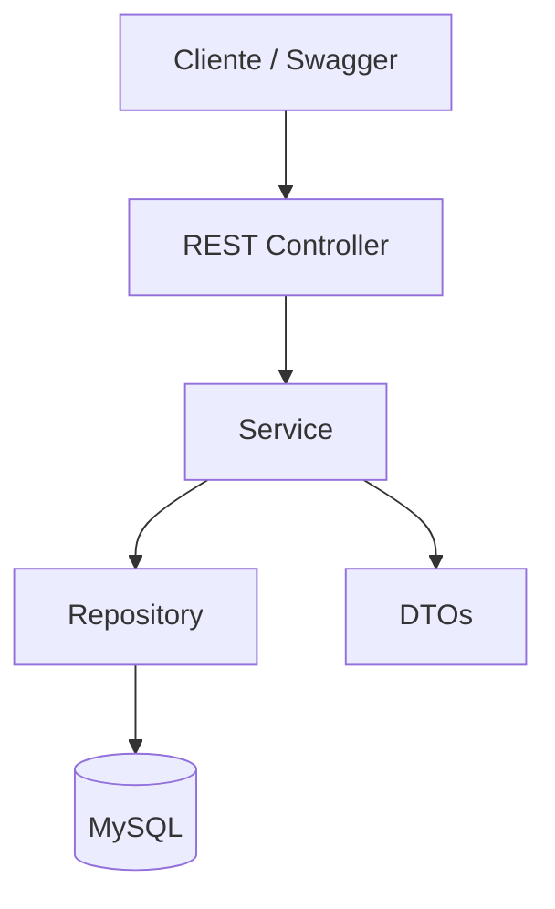
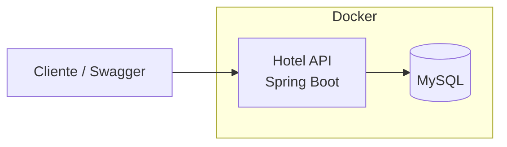
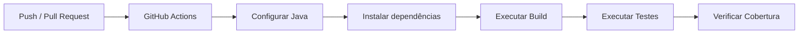

# Hotel API

API REST desenvolvida em **Java com Spring Boot** para gerenciamento de um sistema de hospedagem. O projeto simula operações relacionadas a **locadores, imóveis, clientes e reservas**, aplicando conceitos de desenvolvimento de APIs REST, DTOs, regras de negócio, persistência de dados, documentação de APIs, containerização e **CI/CD**.

> **⚠️ Projeto de estudos**
>
> Este projeto foi desenvolvido exclusivamente para fins de **estudo e aprendizado**. Não se trata de uma aplicação comercial ou de um sistema destinado à utilização em produção.

---

## 🏨 Sobre o projeto

O **Hotel API** é uma aplicação REST que simula parte do funcionamento de uma plataforma de hospedagem.

O sistema permite trabalhar com diferentes entidades do domínio, como:

* **Locadores** — responsáveis pelos imóveis cadastrados.
* **Imóveis** — propriedades disponíveis para hospedagem.
* **Clientes** — pessoas que realizam reservas.
* **Reservas** — registros de hospedagens realizadas pelos clientes.

Além das operações básicas de CRUD, o projeto possui regras de negócio relacionadas ao cadastro, atualização, inativação, reativação e criação de reservas.

O principal objetivo é praticar conceitos comuns no desenvolvimento de aplicações backend utilizando o ecossistema Java e Spring.

---

## 🛠️ Tecnologias utilizadas

| Tecnologia            | Utilização                                       |
| --------------------- | ------------------------------------------------ |
| **Java**              | Linguagem principal do projeto                   |
| **Spring Boot**       | Desenvolvimento da API REST                      |
| **Spring Data JPA**   | Persistência e acesso aos dados                  |
| **MySQL**             | Banco de dados relacional                        |
| **Docker**            | Containerização da aplicação e banco de dados    |
| **Swagger / OpenAPI** | Documentação e visualização dos endpoints da API |
| **Maven**             | Gerenciamento de dependências e build do projeto |
| **GitHub Actions**    | Automação do pipeline de CI/CD                   |

---

## 🏗️ Arquitetura

A aplicação utiliza uma arquitetura em camadas, separando as responsabilidades entre **Controller, Service e Repository**.


```mermaid
flowchart TD
    A[Cliente / Swagger] --> B[REST Controller]

    B --> C[Service]

    C --> D[Repository]

    D --> E[(MySQL)]

    C --> F[DTOs]
```

### Camadas

**Controller**

Responsável por receber as requisições HTTP, realizar o direcionamento das operações e retornar as respostas da API.

**Service**

Contém as regras de negócio da aplicação, como validações, verificações de estado e processamento das operações.

**Repository**

Responsável pela comunicação com o banco de dados utilizando Spring Data JPA.

**DTOs**

Utilizados para controlar os dados recebidos e enviados pela API, evitando o acoplamento direto entre as requisições HTTP e as entidades de persistência.

**MySQL**

Banco de dados responsável pelo armazenamento das informações da aplicação.

---

## 🐳 Arquitetura com Docker

Quando executada utilizando Docker Compose, a aplicação e o banco de dados são executados em containers separados.


```mermaid
flowchart LR
    A[Cliente / Swagger] --> B[Hotel API<br/>Spring Boot]
    B --> C[(MySQL)]

    subgraph Docker
        B
        C
    end
```

Essa abordagem permite configurar o ambiente da aplicação de maneira mais simples, evitando a necessidade de instalar e configurar manualmente o banco de dados para executar o projeto.

As configurações necessárias para a execução da aplicação em containers estão definidas no projeto através do **Docker Compose** e das configurações relacionadas ao Docker presentes no `pom.xml`.

---

# 🔄 CI/CD

O projeto utiliza **GitHub Actions** para automatizar a integração contínua da aplicação.

Sempre que uma alteração é enviada ao repositório, o pipeline executa as etapas necessárias para verificar se o projeto continua compilando e se os testes estão sendo executados corretamente.

### Pipeline


```mermaid
flowchart LR
    A[Push / Pull Request] --> B[GitHub Actions]
    B --> C[Configurar Java]
    C --> D[Instalar dependências]
    D --> E[Executar Build]
    E --> F[Executar Testes]
    F --> G[Verificar Cobertura]
```

### Etapas executadas

**1. Checkout do código**

O GitHub Actions obtém o código-fonte do repositório.

**2. Configuração do Java**

O ambiente de execução é configurado utilizando a versão de Java utilizada pelo projeto.

**3. Build**

O Maven realiza a compilação e construção da aplicação.

```bash
./mvnw clean verify
```

**4. Testes**

Os testes automatizados são executados durante o processo de build.

**5. Verificação de cobertura**

A cobertura dos testes é analisada durante o pipeline, permitindo identificar se o código possui uma cobertura adequada pelos testes automatizados.

Dessa forma, alterações que apresentem problemas durante a compilação ou execução dos testes podem ser identificadas automaticamente pelo pipeline.

### Objetivo do CI/CD

A utilização do GitHub Actions neste projeto tem como objetivo praticar conceitos de:

* Integração Contínua (CI);
* Automação de builds;
* Execução automatizada de testes;
* Verificação de cobertura de testes;
* Pipelines utilizando GitHub Actions;
* Integração entre GitHub e Maven.

---

# 🚀 Configuração local

## Pré-requisitos

Para executar o projeto localmente, é necessário possuir:

* Java 25
* Maven
* Git

Para execução utilizando Docker:

* Docker
* Docker Compose

Para execução sem Docker:

* MySQL instalado e em execução

---

## 📥 Clonando o projeto

Clone o repositório:

```bash
git clone https://github.com/VictorBortolotto/rest-java-api.git
```

Entre no diretório do projeto:

```bash
cd rest-java-api
```

---

## ⚙️ Configuração do `application.properties`

As configurações da aplicação não são disponibilizadas no repositório. Portanto, antes de executar o projeto localmente, é necessário criar o arquivo:

```text
src/main/resources/application.properties
```

Esse arquivo deve conter as configurações necessárias para conexão com o banco de dados e demais propriedades utilizadas pela aplicação.

Por exemplo:

```properties
spring.datasource.url=jdbc:mysql://localhost:3306/hotel
spring.datasource.username=SEU_USUARIO
spring.datasource.password=SUA_SENHA

spring.jpa.hibernate.ddl-auto=update
spring.jpa.show-sql=true
```

> **⚠️ Importante:** os valores de usuário, senha e outras informações específicas do ambiente não devem ser versionados no Git. Utilize as configurações correspondentes ao seu ambiente local.

Se estiver utilizando Docker Compose, as configurações de conexão devem utilizar os valores definidos para os containers e para o serviço do MySQL.

---

## 📦 Build do projeto

Após configurar o `application.properties`, execute:

```bash
mvn clean install
```

Ou, utilizando o Maven Wrapper:

```bash
./mvnw clean install
```

---

# 🐳 Executando com Docker

Com o Docker instalado e em execução, execute:

```bash
docker compose up --build
```

O Docker Compose será responsável por criar e iniciar os containers necessários para a aplicação.

Para encerrar a aplicação:

```bash
docker compose down
```

### Configuração do Docker no Maven

O `pom.xml` possui configurações relacionadas à construção/execução da aplicação utilizando Docker.

Essas configurações complementam o `docker-compose.yml`, que é responsável por definir os serviços, containers e demais configurações necessárias para executar a aplicação e o banco de dados.

> **Observação:** as configurações relacionadas ao Docker presentes no `pom.xml` não são necessárias para executar a aplicação diretamente em um ambiente local utilizando apenas Maven e MySQL.

---

# 💻 Executando localmente

Também é possível executar a aplicação diretamente pelo Maven, sem utilizar Docker.

### 1. Criar o banco de dados

É necessário possuir uma instalação local do **MySQL** em execução.

Crie um banco de dados chamado:

```sql
CREATE DATABASE hotel;
```

### 2. Configurar o `application.properties`

Configure as informações de conexão com o banco de dados:

```properties
spring.datasource.url=jdbc:mysql://localhost:3306/hotel
spring.datasource.username=SEU_USUARIO
spring.datasource.password=SUA_SENHA
```

### 3. Executar a aplicação

Após configurar o banco de dados e o `application.properties`, execute:

```bash
mvn spring-boot:run
```

Ou:

```bash
./mvnw spring-boot:run
```

A aplicação será iniciada utilizando a configuração definida no projeto.

---

# 📖 Documentação da API

A API possui documentação utilizando **Swagger / OpenAPI**, permitindo visualizar e testar os endpoints disponíveis diretamente pelo navegador.

Após iniciar a aplicação, a interface do Swagger estará disponível em:

```text
http://localhost:8080/swagger-ui/index.html
```

A aplicação utiliza a porta **8080** por padrão.

> **Swagger UI:** `localhost:8080/swagger-ui/index.html`

---

## 📌 Objetivos de estudo

Este projeto foi desenvolvido com o objetivo de praticar:

* Desenvolvimento de APIs REST com Spring Boot;
* Operações CRUD;
* Arquitetura em camadas;
* Utilização de DTOs;
* Regras de negócio;
* Validação de dados;
* Persistência com Spring Data JPA;
* Integração com MySQL;
* Documentação utilizando Swagger/OpenAPI;
* Containerização utilizando Docker;
* Organização e estruturação de projetos Java;
* Integração Contínua (CI);
* Automação de builds e testes;
* Verificação de cobertura de testes;
* Criação e configuração de pipelines com GitHub Actions.

---

## 📄 Licença

Este projeto é destinado exclusivamente para fins educacionais e de estudo.

---

# Autor

**Victor Augusto Campos Bortolotto**


[](https://www.linkedin.com/in/victor-augusto-campos-bortolotto/)

[](mailto:victorcamposbortolottowork@gmail.com)
